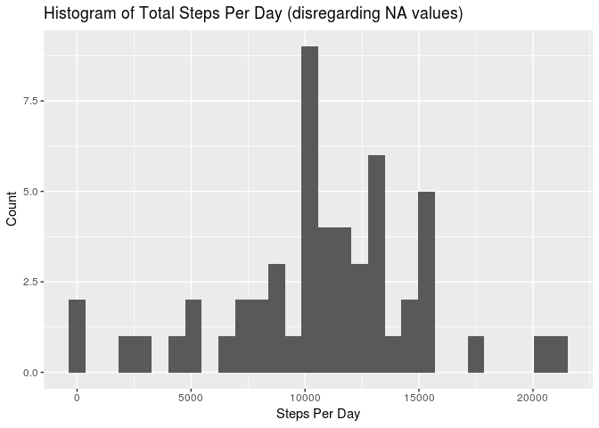
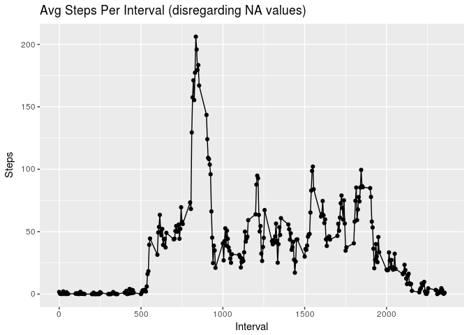
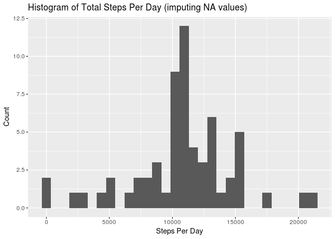
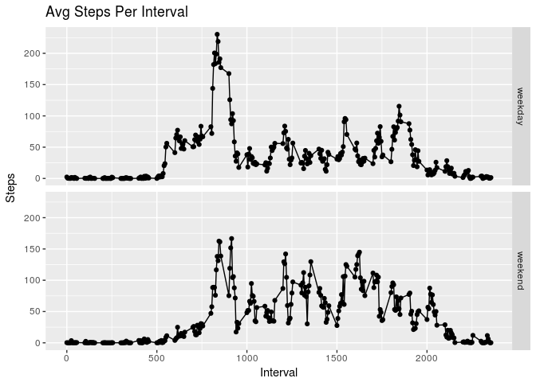

## Loading and preprocessing the data

```r
# set environment
options(scipen=999)
base_dir <- "~/Documents/coursera/RepRes_2018/RepData_PeerAssessment1"
library(ggplot2)
library(dplyr)
```

```
## 
## Attaching package: 'dplyr'
```

```
## The following objects are masked from 'package:stats':
## 
##     filter, lag
```

```
## The following objects are masked from 'package:base':
## 
##     intersect, setdiff, setequal, union
```

```r
# get data
setwd(base_dir)
unzip("activity.zip")
activity_df0 <- read.table(file="activity.csv", sep=",", header=TRUE)
```


## What is mean total number of steps taken per day?

```r
# remove rows with NA values
no_na_df <- activity_df0[!is.na(activity_df0$steps), ]

# calculate total steps by date
steps_per_day_df <- aggregate(steps ~ date, no_na_df, sum)

# histogram of steps per day
ggplot(data=steps_per_day_df, aes(steps_per_day_df$steps)) + 
  geom_histogram() + 
  labs(title="Histogram of Total Steps Per Day (disregarding NA values)") +
  labs(x="Steps Per Day", y="Count")
```

```
## `stat_bin()` using `bins = 30`. Pick better value with `binwidth`.
```

<!-- -->

```r
# avg steps per day
no_na_mean = mean(steps_per_day_df$steps)
no_na_median = median(steps_per_day_df$steps)
no_na_mean
```

```
## [1] 10766.19
```

```r
no_na_median
```

```
## [1] 10765
```

After discounting rows with missing values of the steps column, the mean number of steps per day was 10766.  The median number of steps per day was 10765.

## What is the average daily activity pattern?

```r
# plot avg steps over time
steps_per_interval_df <- aggregate(steps ~ interval, no_na_df, mean)
ggplot(data=steps_per_interval_df, aes(x=interval, y=steps, group=1)) +
  geom_line() +
  geom_point() +
  labs(title="Avg Steps Per Interval (disregarding NA values)") +
  labs(x="Interval", y="Steps")
```

<!-- -->

```r
# find interval with max average steps
max_interval = steps_per_interval_df %>% top_n(1, steps)
max_interval
```

```
##   interval    steps
## 1      835 206.1698
```

The interval with the highest mean number of steps was 835 with and average of 206 steps.


## Imputing missing values

```r
# count rows with steps=NA
na_rows = nrow(activity_df0[is.na(activity_df0$steps), ])
na_rows
```

```
## [1] 2304
```

```r
# replace NA values with mean for respective interval (dplyr)
fill_na_df <- activity_df0 %>% 
  rowwise() %>%
  mutate(steps = if_else(is.na(steps), as.integer(round(steps_per_interval_df[ which(steps_per_interval_df$interval==interval), ]$steps)), steps))

# calculate total steps by date
steps_per_day_filled_df <- aggregate(steps ~ date, fill_na_df, sum)

# histogram of steps per day
ggplot(data=steps_per_day_filled_df, aes(steps_per_day_filled_df$steps)) + 
  geom_histogram() + 
  labs(title="Histogram of Total Steps Per Day (imputing NA values)") +
  labs(x="Steps Per Day", y="Count")
```

```
## `stat_bin()` using `bins = 30`. Pick better value with `binwidth`.
```

<!-- -->

```r
# avg steps per day
filled_mean = mean(steps_per_day_filled_df$steps)
filled_median = median(steps_per_day_filled_df$steps)
filled_mean
```

```
## [1] 10765.64
```

```r
filled_median
```

```
## [1] 10762
```

The original data set contained 2304 rows for which the steps column was missing a value.  For each of these rows, the steps value was imputed using the mean value for the associated time interval across the entire data set.

After imputing missing values for the steps column, the mean number of steps per day was 10765.6.  The median number of steps per day was 10762.


## Are there differences in activity patterns between weekdays and weekends?

```r
# create factor var to label each row as weekday / weekend
fill_na_df <- fill_na_df %>% mutate(weekday = ifelse(weekdays(as.Date(date)) %in% c("Saturday", "Sunday"), "weekend", "weekday"))
fill_na_df$weekday <- factor(fill_na_df$weekday)

# plot avg steps over time, by weekday / weekend
steps_per_interval_df2 <- aggregate(steps ~ interval+weekday, fill_na_df, mean)
ggplot(data=steps_per_interval_df2, aes(x=interval, y=steps, group=1)) +
  geom_line() +
  geom_point() +
  labs(title="Avg Steps Per Interval") +
  labs(x="Interval", y="Steps") + 
  facet_grid(weekday ~ .)
```

<!-- -->

